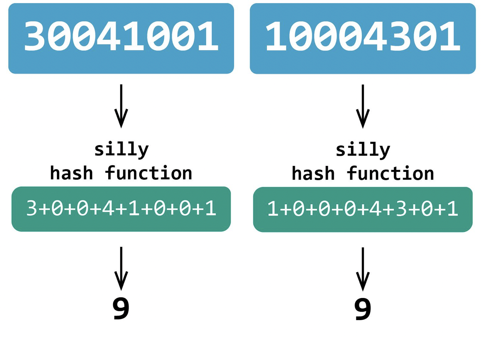

# Введение в криптографию

В широком смысле, криптография – это наука о методах обеспечения услуг информационной безопасности. Развитие криптографии началось с древних времен, ее история насчитывает 4 тысячи лет. Поначалу криптография решала всего одну задачу – обеспечение конфиденциальности при передаче и хранении данных. Для ее решения в давние времена использовались такие механизмы, как схемы перестановки слов текста, перестановки символов текста, использование альтернативных алфавитов и т.п. 

В настоящее время криптография использует математическую базу. Применяются специальные преобразования, которые определены в таких разделах математики, как теория чисел, теория групп, теория колец, теория полей, а также в некоторых других разделах. 

Криптоанализ – наука о методах получения секретных ключей, а также о методах обнаружения уязвимостей криптографических алгоритмов и их эксплуатации. 

Современная криптография включает в себя схемы симметричного и асимметричного шифрования, схемы цифровой подписи, схемы хеширования данных, методы управления ключами, схемы доказательств с нулевым разглашением и постквантовую криптографию. 

Основные криптографические преобразования:

- хэширование 
- симметричное шифрование 
- асимметричное шифрование 
- цифровая подпись

## Хэш-функции

Хэш-функция – это функция преобразования массива входных данных произвольной длины в выходную битовую строку фиксированной длины, которая выполняется с помощью определенного алгоритма. 

Эта функция однонаправленная, потому что, имея выходное значение, то есть число определенной длины, невозможно определить, какие данные были поданы на вход. Функция считается криптографически устойчивой, поскольку ее можно атаковать только «грубой силой», то есть перебирать все возможные варианты входных значений и добиваться, чтобы выходное значение соответствовало заданному. 
 


На вход хэш-функция может принимать сообщение практически неограниченного размера (любые данные), а на выходе получается уникальное хэш-значение. Имея хэш-значение, полученное с помощью криптографически стойкой хэш-функции, невозможно определить, какие данные были поданы ей на вход. 

Устройство функции хэширования можно понять на примере такой функции, которая считает сумму цифр входного сообщения. Такая функция обладает следующими особенностями. Во-первых, в этом случае, результат вычисляется достаточно быстро за счет простоты алгоритма подсчета. Во-вторых, такая функция действительно является однонаправленной, так как выходное значение содержит данные только о сумме цифр в сообщении, но не о расположении этих цифр. То есть сложность восстановления исходного сообщения растет с его длиной.

Суть работы типичной хэш-функции заключается в циклическом перемешивании и использовании основных битовых операций(and,xor, rot, add, or) для входных данных. 


### Требования к хэш-функции

- **Стойкость к коллизиям**. Стойкость хэш-функции к коллизиям означает, что отсутствует алгоритм, позволяющий находить коллизии за относительно короткое время. Коллизией называют ситуацию, когда существует пара значений, подав которые на вход хэш-функции мы получим один и тот же выходной результат
- **Стойкость к поиску первого прообраза**. Стойкость к поиску первого прообраза (необратимость) является требованием к хэш-функции, при выполнении которого невозможно восстановить исходное сообщение за адекватный промежуток времени, зная только соответствующее ему хэш-значение
- **Стойкость к поиску второго прообраза**. Стойкость к поиску второго прообраза является требованием, которое подразумевает, что при его выполнении сторона, имеющая исходное сообщение и соответствующее ему хэш-значение, не может создать другое сообщение, которое на выходе хэш-функции предоставит тот же результат
- Криптографически стойкая хэш-функция также должна обладать свойством, согласно которому изменение одного бита на входе должно приводить к изменению в среднем половины выходных битов. Проиллюстрировать на примере подобное свойство можно следующим образом. 

Коллизия хеш-функции — это получение одинакового значения функции для разных сообщений и идентичного начального буфера. В отличие от коллизий, псевдоколлизии определяются как равные значения хеша для разных значений начального буфера, причём сами сообщения могут совпадать или отличаться. 



### Область применения хеш-функций

- хэш-значения используются в качестве контрольных сумм при передаче данных. Чтобы проверить, что сообщение не было случайно нарушено из-за шумов в канале передачи данных. Принимающая сторона может повторно вычислить хэш-значение от полученных данных и сравнить его с уже имеющимся;
- такие функции используются для поиска дубликатов при хранении или для сравнения больших массивов данных. Чтобы не сравнивать большие объемы данных непосредственно, можно хранить соответствующие им значения хэш-функций и сравнивать только эти значения. Если значения хэш-функции для разных наборов данных совпадают, значит с очень большой вероятностью и сами данные совпадают. Это значительно ускоряет процесс;
- при формировании цифровой подписи обычно подписываются не сами данные сообщения, а их хэш-значение. Так получатель может проверить цифровую подпись для хэш-значения и быть уверенным (с высокой вероятность), что отправитель подписывал именно это сообщение;
- при построении ассоциативных массивов;
- при сохранении паролей в системах защиты в виде хеш-кода (для восстановления пароля по хеш-коду требуется функция, являющаяся обратной по отношению к использованной хеш-функции).

### Алгоритмы хэширования

Существует множество алгоритмов хеширования, отличающихся различными свойствами. Примеры свойств:

- разрядность;
- вычислительная сложность;
- криптостойкость.

Выбор той или иной хеш-функции определяется спецификой решаемой задачи. Простейшим примером хеш-функции может служить «обрамление» данных циклическим избыточным кодом (англ. CRC, cyclic redundancy code)

**Циклический избыточный код (англ. Cyclic redundancy check, CRC)** — алгоритм нахождения контрольной суммы, предназначенный для проверки целостности данных.

Одним из основных параметров CRC является порождающий полином. 

С порождающим полиномом связан другой параметр — его степень, которая определяет количество битов, используемых для вычисления значения CRC. На практике наиболее распространены 8-, 16- и 32-битовые слова, что является следствием особенностей архитектуры современной вычислительной техники. 

Ещё одним параметром является начальное (стартовое) значение слова. Указанные параметры полностью определяют «традиционный» алгоритм вычисления CRC. Существуют также модификации алгоритма, например, использующие обратный порядок обработки битов. 

Из файла берётся первое слово — это может быть битовый (CRC-1), байтовый (CRC-8) или любой другой элемент. Если старший бит в слове «1», то слово сдвигается влево на один разряд с последующим выполнением операции XOR c порождающим полиномом. Соответственно, если старший бит в слове «0», то после сдвига операция XOR не выполняется. После сдвига теряется старый старший бит, а младший бит освобождается — его значение устанавливается равным нулю. На место младшего бита загружается очередной бит из файла, и операция повторяется до тех пор, пока не загрузится последний бит файла. После прохождения всего файла, в слове остается остаток, который и является контрольной суммой. 

Пример реализации CRC-8:

```c
#define POLYNOMIAL 0xD8  /* 11011 followed by 0's */

uint8_t crcNaive(uint8_t const message) {
    uint8_t remainder;	
    remainder = message;
    for (uint8_t bit = 8; bit > 0; --bit) {
        if (remainder & 0x80) { 		// If the uppermost bit is a 1...
            remainder ^= POLYNOMIAL; 	// XOR the previous remainder with the divisor.
        }

        // Shift the next bit of the message into the remainder.
        remainder = (remainder << 1);
    }

    return (remainder >> 4); // Return only the relevant bits of the remainder as CRC.

}
```

**MD5 (англ. Message Digest 5)** — 128-битный алгоритм хеширования, разработанный в 1991 году. Предназначен для создания дайджестов сообщения произвольной длины и последующей проверки их подлинности. Широко применялся для проверки целостности информации и хранения хешей паролей.


**Secure Hash Algorithm 1** — алгоритм криптографического хеширования. Описан в RFC 3174. Для входного сообщения произвольной длины (максимум `2^64 - 1` бит, что примерно равно 2 эксабайта) алгоритм генерирует 160-битное (20 байт) хеш-значение, называемое также дайджестом сообщения, которое обычно отображается как шестнадцатеричное число длиной в 40 цифр. Используется во многих криптографических приложениях и протоколах. Также рекомендован в качестве основного для государственных учреждений в США.


**PBKDF2** — это алгоритм, который используется для получения ключей. Он не был предназначен для хеширования паролей, но из-за своего свойства быть медленным он вполне подходит для этой цели. Полученный производный ключ (HMAC) можно использовать для безопасного хранения паролей. Это не идеальная функция для хеширования паролей, но ее легко реализовать, и она построена на алгоритмах хэширования SHA-1 или SHA-2 (подойдет любой HMAC, но это наиболее распространенные и безопасные). Для получения ключа PBKDF2 делает следующее: 

```
	DK = PBKDF2(PRF, пароль, salt, c, dkLen) 
```
Где 

- DK — производный ключ, 
- PRF — предпочтительная функция HMAC (это может быть SHA-1/2 HMAC, пароль используется как ключ для HMAC, а salt — как текст), 
- c — количество итераций, минимальное количество - 1024
- dkLen - длина полученного ключа. 
- salt - cоль. Должна, по определению стандарта, иметь длину не менее 64 бит. 

Пример использования - SHA-1-HMAC (пароль + соль), вычисляемый 1024 раз. Тем не менее, на самом деле это не обеспечивает достаточной защиты при брутфорсе в распределенных системах или GPU (графическом процессоре). Также есть предостережение, когда пароль превышает 64 байта, пароль будет сокращен путем применения к нему хэша алгоритмом PBKDF2, чтобы он не превышал размер блока. Например, при использовании HMAC-SHA-1 пароль длиной более 64 байт будет сокращен до SHA-1 (пароль) размером 20 байт. Это означает, что пароли длиннее 64 байт не обеспечивают дополнительной безопасности, когда речь идет о взломе ключа, используемого для создания HMAC, но могут даже снизить безопасность, поскольку длина ключа будет уменьшена. 

**bcrypt** в настоящее время является де-факто безопасным стандартом для хеширования паролей. Он получен из блочного шифра Blowfish, который для генерации хэша использует таблицы поиска, которые инициируются в памяти. Это означает, что для создания хэша необходимо использовать определенный объем памяти. 

**scrypt** — это еще один алгоритм хеширования, обладающий теми же свойствами, что и bcrypt, за исключением того, что при увеличении количества раундов он экспоненциально увеличивает время вычислений и объем памяти, необходимый для генерации хэша. Scrypt был создан в ответ на развивающиеся атаки на bcrypt и совершенно невозможен при использовании FPGA или GPU из-за ограничений памяти. Scrypt требует хранения серии «моментальных снимков» данных промежуточного состояния, которые используются в дальнейших операциях деривации. Эти снимки, хранящиеся в памяти, растут экспоненциально по сравнению с увеличением количества раундов. Таким образом, добавление раунда значительно усложнит подбор пароля. Scrypt все еще является относительно новым по сравнению с bcrypt, что делает его менее проверенным, чем bcrypt [2]. 

### Взломы хэшей

На данный момент существуют несколько видов «взлома» хешей MD5 — подбора сообщения с заданным хешем: 

- Brute-force
- Перебор по словарю
- RainbowCrack

**Атаки переборного типа**. Если решать задачу обратных хеш-функций «влоб», то нам понадобится база данных, которая будет содержать `2^128` ключей длиной в 128 бит и строке, которая соответствует каждому ключу нефиксированной длины. Объем только ключей в данном случае займет `3 * 10^29 ГБ` чистого пространства. Естественно, это себе не может позволить ни одна вычислительная среда. 

Вычисление такого объема возможных комбинаций «на лету» также не представляется возможным в связи с временными затратами. Даже, если будет железо, способное перебирать 33 млрд вариантов в секунду – то для полного перебора (худший вариант) понадобится `10^21` лет. Если упростить задачу на кол-во символов в пароле и набора возможных символов, то можно добиться более радужных временных рамок.

Существует физический аргумент в пользу того, что 128-битный симметричный ключ вычислительно защищен от атаки грубой силы. Так называемый предел Ландауэра, подразумеваемый законами физики, устанавливает нижний предел энергии, необходимой для выполнения вычисления `kT · ln(2)` на бит, стираемый при вычислении, где T – температура вычислительного устройства в кельвинах, k – постоянная Больцмана, а `ln(2) ≈ 0.693`. Никакое необратимое вычислительное устройство не может потреблять меньше энергии, чем это, даже в принципе. Таким образом, чтобы просто пролистать возможные значения для 128-битного симметричного ключа (игнорируя фактические вычисления для его проверки), теоретически потребуется `2^128 - 1` битовых переворотов на обычном процессоре. Если предположить, что расчет происходит при комнатной температуре (`≈ 300 K`), можно применить предел фон Неймана-Ландауэра для оценки необходимой энергии в `≈10^18` джоулей, что эквивалентно потреблению 30 гигаватт мощности в течение одного года. Это равно `30×10^9 Вт × 365 × 24 × 3600 c = 9,46×10^17 Дж` или 262,7 ТВтч (около 0,1% годового производства энергии в мире). Полное фактическое вычисление — проверка каждого ключа, чтобы увидеть, было ли найдено решение — потребовало бы во много раз больше этого объема. Кроме того, это просто потребность в энергии для циклического прохождения ключевого пространства; фактическое время, необходимое для переключения каждого бита, не учитывается, что, безусловно, больше 0 (см. предел Бремермана).

Чтобы сократить время перебора, можно понадеяться на тот факт, что человек – существо ленивое и не заботится о своей безопасности, поэтому его пароли зачастую просты и коррелируют с обычными словами. На основе данного факта составляются «**словари**» - наиболее часто употребляемые пароли, а также слова национального языка. Таким образом, имея дело с «дилетантом» и имея большой словарь, можно за считанные секунды получить пароль, соответствующий хешу.

**Радужная таблица** — специальный вариант таблиц поиска (lookup table), использующий механизм уменьшения времени поиска за счет увеличения занимаемой памяти или time-memory tradeoff. Основная идея данного метода — достижение компромисса между временем поиска по таблице и занимаемой памятью.


Радужная таблица создается построением цепочек возможных паролей заданной длины. Каждая цепочка начинается со случайного возможного пароля заданной длины и заданного алфавита, затем подвергается действию хеш-функции и функции редукции – функции, которая возвращает пседвослучайное слово того же алфавита и длины (возможный пароль) на основе полученного хэша. Промежуточные пароли в цепочке отбрасываются и в таблицу записывается только первый и последний элементы цепочек. Создание таблиц требует времени и памяти (вплоть до сотен гигабайт), но они позволяют очень быстро (по сравнению с обычными методами) восстановить исходный пароль.

Пример функции редукции [1] – создание слова заданной длины и алфавита из псевдо-случайных букв данного алфавита. При этом, перед созданием слова значение генератора псевдослучайных чисел устанавливается в значение, которое соответствует значению хэша, у которого все байты поменяны местами в последовательности, уникальной для данной цепочки, которая зависит от индекса расположения в этой цепочки. 

Для восстановления пароля данное значение хеш-функции подвергается функции редукции и ищется в таблице. Если не было найдено совпадения, то снова применяется хеш-функция и функция редукции. Данная операция продолжается, пока не будет найдено совпадение. После нахождения совпадения, цепочка, содержащая его, восстанавливается для нахождения отброшенного значения, которое и будет искомым паролем.

В итоге получается таблица, которая может с высокой вероятностью восстановить пароль за небольшое время.

**Пример радужной таблицы**. Имеется хеш (`re3xes`), который надо обратить (восстановить соответствующий пароль), и радужная таблица, полученная с использованием трёх функций редукции. 

1.	Вычисляем цепочку длины 1 от начального хеша: `R3("re3xes")="crypto"`. Данный пароль не является концом ни одной табличной цепочки.
2.	Вычисляем цепочку длины 2: `R3(H(R2("re3xes")))="linux23"`.
3.	Данный пароль найден в таблице. Берём начало найденной цепочки (пароль `passwd`).
4.	Восстанавливаем табличную цепочку до тех пор, пока не получим исходный хеш `re3xes`.
5.	Искомый хеш найден в цепочке, атака успешна. Предшествующий данному значению хеша пароль `culture` является искомым.

Радужные таблицы не позволят сократить этот порядок. Это было бы и противоречиво тезису о «необратимости» хеш-функций. Все что могут таблицы — это хранить некоторую предвычисленную (за время, большее времени прямого перебора!) информацию, позволяющую для каждого конкретного значения найти соответствующий ему пароль довольно быстро

**Защита от радужных таблиц**. Один из распространённых методов защиты от взлома с помощью радужных таблиц — использование необратимых хеш-функций, которые включают salt - строка данных, которая передаётся хеш-функции вместе с паролем. Существует множество возможных схем смешения затравки и пароля. Например, рассмотрим следующую функцию для создания хеша от пароля: 

```
	hash = MD5(password + salt)
```

Для восстановления такого пароля взломщику необходимы таблицы для всех возможных значений соли. При использовании такой схемы, соль должна быть достаточно длинной (6‒8 символов), иначе злоумышленник может вычислить таблицы для каждого значения соли, случайной и различной для каждого пароля. Таким образом два одинаковых пароля будут иметь разные значения хешей, если только не будет использоваться одинаковая соль. 
Другим возможным способом борьбы против атак, использующих предварительные вычисления, является растяжение ключа. Например: 

```
	hash = HASH(password + salt)
	for 1 to 65536 do
		hash = HASH(hash + password + salt)
```

## Шифрование

### Симметричное шифрование

Шифрование – это видоизменение текста (или любых других данных) таким образом, что только тот, кто имеет соответствующий ключ, имеет возможность восстановить исходный текст. Схематически процесс симметричного шифрования будет выглядеть таким образом, как показано на рисунке. 


Существует функция, которая выполняет шифрование данных: на вход она принимает открытый текст и ключ шифрования, а на выходе возвращает зашифрованные данные, или, как часто говорят, шифротекст. Также существует обратная функция, которая выполняет расшифрование: на вход она принимает зашифрованные данные и точно такой же ключ шифрования, а на выходе возвращает открытые данные, т. е. исходный текст. Этот тип шифрования называют симметричным, потому что для шифрования и расшифрования применяется один и тот же ключ. 

Ярким примером симметричного шифрования является **шифр Вернама**, он же одноразовый блокнот. Суть метода является сложение по модулю исходного текста с одноразовым ключом. В этом случае ключ шифрования (он же является ключом расшифрования) должен быть равным по длине исходному сообщению. Такой шифр является ярким примером абсолютно стойкого шифра. Это значит, что при перехвате только шифротекста злоумышленник не сможет получить никакой информации об исходном сообщении. 

У симметричного шифрования есть и **недостатки**:

- необходимость обеспечения конфиденциальности секретного ключа при его передаче получателю сообщения еще до начала коммуникации, поскольку для работы необходимо наличие этого ключа и у отправителя, и у получателя. 
- сложность создания и хранения нового ключа для каждого нового участника в системе, где используется защищенная коммуникация, основанная только на симметричном шифровании. Сложность этой задачи увеличивается квадратично с увеличением количества участников, поскольку количество новых ключей возрастает с добавлением каждого нового пользователя.

Классическим представителем симметричного шифрования является **алгоритм AES (Advanced Encryption Standard)** (основанный на алгоритме Rijndael), принятый в качестве стандарта шифрования правительством США.


### Блочное и потоковое шифрование

Применение функции шифрования ко всему сообщению в целом реализуется очень редко. Практически все применяемые криптографические методы связаны с разбиением сообщения на большое число фрагментов (или знаков) фиксированного размера, каждый из которых шифруется отдельно. Такой подход существенно упрощает задачу шифрования, так как сообщения обычно имеют различную длину.

Можно выделить следующие характерные признаки методов шифрования данных:

- выполнение операций с отдельными битами или блоками.
- зависимость или независимость функции шифрования от результатов шифрования предыдущих частей сообщения.
- зависимость или независимость шифрования отдельных знаков от их положения в тексте.

В соответствии с этим различают три основных способа шифрования:

- поточные шифры;
- блочные шифры;
- блочные шифры с обратной связью.

**Поточное шифрование** состоит в том, что каждый бит открытого текста и соответствующий бит ключа преобразовываются по определенному алгоритму (например, складываются по модулю 2). К достоинствам поточных шифров относятся высокая скорость шифрования, относительная простота реализа¬ции и отсутствие размножения ошибок. Недостатком является необходимость использовать для каждого сообщения другой ключ. Это обусловлено тем, что если два различных сообщения шифруются на одном и том же ключе, то эти сообщения легко могут быть расшифрованы. Поэтому часто используют дополнительный, случайно выбираемый ключ сообщения, который передается в начале сообщения и применяется для модификации ключа шифрования. В результате разные сообщения будут шифроваться с помощью различных последовательностей. Это требует передачи информации синхронизации перед заго¬ловком сообщения, которая должна быть принята до расшифровывания любого сообщения.


Поточные шифры широко применяются для шифрования преобразованных в цифровую форму речевых сигналов и цифровых данных, требующих оперативной доставки потребителю информации.

При **блочном шифровании** открытый текст сначала разбивается на равные по длине блоки, затем применяется зависящая от ключа функция шифрования для преобразования блока открытого текста длиной `m` бит в блок шифротекста такой же длины. При блочном шифровании каждый бит блока шифротекста зависит от значений всех битов соответствующего блока открытого текста и никакие два блока открытого текста не могут быть представлены одним и тем же блоком шифротекста. При этом небольшие изменения в шифротексте вызывают большие и непредсказуемые изменения в соответствующем открытом тексте и наоборот. 

Вместе с тем применение блочного шифра имеет серьезные недостатки:

- вследствие детерминированного характера шифрования при фиксированной длине блока 64 бита можно осуществить криптоанализ шифротекста «со словарем» в ограниченной форме. Это обусловлено тем, что идентичные блоки открытого текста длиной 64 бита в исходном сообщении представляются идентичными блоками шифротекста, что позволяет криптоаналитику сделать определенные выводы о содержании сообщения. 
- размножение ошибок. Результатом изменения только одного бита в принятом блоке шифротекста будет неправильное расшифровывание всего блока. Это, в свою очередь, приведет к появлению искаженных битов (от 1 до 64) в восстановленном блоке исходного текста.

Из-за отмеченных недостатков блочные шифры редко применяются в указанном режиме для шифрования длинных сообщений. Однако в финансовых учреждениях, где сообщения часто состоят из одного или двух блоков, блочные шифры широко используют в режиме прямого шифрования. Такое применение обычно связано с возможностью частой смены ключа шифрования, поэтому вероятность шифрования двух идентичных блоков открытого текста на одном и том же ключе очень мала.

Криптосистема с открытым ключом также является системой блочного шифрования и должна оперировать блоками довольно большой длины. Это обусловлено тем, что криптоаналитик знает открытый ключ шифрования и мог бы заранее вычислить и составить таблицу соответствия блоков открытого текста и шифротекста. Если длина блоков мала, например 30 бит, то число возможных блоков не слишком большое, и может быть составлена полная таблица, позволяющая моментально расшифровать любое сообщение с использованием известного открытого ключа.

**Режим обратной связи по шифротексту** (англ. Cipher Feedback Mode, CFB) — один из вариантов использования симметричного блочного шифра, при котором для шифрования следующего блока открытого текста он складывается по модулю 2 с перешифрованным (блочным шифром) результатом шифрования предыдущего блока. Ошибка, которая возникает в шифротексте при передаче (например, из-за помех), сделает невозможным расшифровку как блока, в котором ошибка произошла, так и следующего за ним, однако не распространяется на последующие блоки. 


### Асимметричное шифрование 

Асимметричная криптография впервые была представлена в 1970-х гг. и является революцией в криптографии. Асимметричная криптография использует не один ключ, а так называемую ключевую пару. Ключевая пара состоит, как правило, из личного ключа и открытого ключа. Личный ключ вы должны хранить в секрете, а открытый ключ можете передать своему контрагенту, с которым будете дальше взаимодействовать. Допустим, Алиса хочет принимать от своих друзей такие сообщения, которые сможет читать только она. Тогда по схеме асимметричного шифрования она генерирует ключевую пару. Личный ключ она оставляет у себя, а открытый размещает где-нибудь на своей страничке в социальной сети (либо сообщает его потенциальному собеседнику другим способом). Когда один из друзей Алисы хочет отправить ей конфиденциальное сообщение, он шифрует его с помощью открытого ключа Алисы и может передавать полученный шифротекст через открытые каналы передачи данных. Получив сообщение, Алиса расшифровывает его своим личным ключом. Любая другая сторона, которая бы перехватила это сообщение, не смогла бы получить доступ к смысловому содержимому сообщения. Схематично процесс изображен на рисунке. 


Существует функция шифрования, которая принимает на вход открытые данные и открытый ключ, а на выход возвращает зашифрованные данные. Обратная функция называется функцией расшифрования. Она принимает зашифрованное сообщение и личный ключ получателя, а на выход возвращает открытый текст этого сообщения.

Классическим представителем ассиметричного шифрования является алгоритм **RSA (Rivest, Shamir, Adleman)**. Как и все алгоритмы ассиметричного шифрования, данный алгоритм нуждается в паре ключей: публичный и приватный. Каждый из ключей представлен в виде пары чисел. RSA-ключи генерируются следующим образом:

1) выбираются два различных случайных простых числа `p` и `q` заданного размера (например, 1024 бита каждое);
2) вычисляется их произведение: `n = p ⋅ q`, которое называется модулем;
3) вычисляется значение функции Эйлера от числа `n`:  `φ(n) = (p - 1) ⋅ (q - 1)`
4) выбирается целое число `e`, взаимно простое со значением функции `φ(n)`. На практике, значение данного числа = 65537. Данное число называют открытой экспонентой (public exponent);
5) вычисляется число `d`, мультипликативно обратное к числу `e` по модулю `φ(n)`: `(d ⋅ e) % φ(n) = 1`. Число `d` называется секретной экспонентой; обычно оно вычисляется при помощи расширенного алгоритма Евклида.
6) пара `(e, n)`  представляет собой открытый ключ;
7) пара `(d, n)`  представляет собой приватный ключ;

Алгоритм RSA базируется на математичсеком утверждении, что для вычисленной пары ключей действует правило:

```
		cipher = origin ^ e % n
		origin = cipher ^ d % n
```

Данное правило действует также и для кодирование секретным ключом, и дешифрация публичным (например, когда паблишер создал и подписал лицензионный ключ, а все потребилели верифицируют его корректность).

Следует отметить, что алгоритм работает исключительно с числами. И для работы с данным алгоритмом Вам надо делить оригинальную строку на нечто, что можно преобразовать в числа.


## Цифровые подписи

### Генерация ключей 

Для владельца ключа важно, чтобы никто другой не мог украсть, рассчитать или генерировать (воспроизводить) такие же ключевые данные. Что это значит? Пользователи криптографических средств защиты должны использовать надежные генераторы случайных чисел, которые выдают действительно случайные последовательности. Важно отметить, что генераторы могут быть программными и аппаратными. 

Программные генераторы в прямом смысле не могут генерировать случайные числа. Они генерируют так называемые псевдослучайные числа (последовательности чисел). Это значит, что через определенный промежуток времени числа начинают повторяться с определенной периодичностью (циклически). Этот период можно определить, но чаще всего он известен заранее. Очевидно, что злоумышленник, владея такими знаниями, может воспользоваться ими в личных интересах.

Аппаратные генераторы чаще всего строятся на основе стохастических процессов, которые сложно или невозможно предсказывать. Например, могут использоваться диоды зенеровского пробоя или радиоактивное излучение, а также специальные датчики, которые улавливают шум этих процессов, оцифровывают его и в результате получается поток случайных бит. На основе данных из этого потока можно генерировать ключи для применения в криптографических схемах. 

Итак, генерации случайных чисел нужно уделять особое внимание. Генератор случайных чисел может использовать комбинацию обеих реализаций: программной и аппаратной. Следовательно, можно использовать шум с микрофона смартфона либо показания с таких датчиков, как гироскоп или акселерометр, для повышения случайности путем внесения большей энтропии (хаотичности, непредсказуемости) в процесс генерации случайных чисел. Энтропия – это мера неопределенности системы, которая характеризует вероятность возникновения некоторого символа или группы символов во всем потоке данных. 

**Компрометация ключей** – это понятие, которое подразумевает факт доступа посторонних лиц к секретным ключам или подозрение на доступ. Скомпрометированный ключ представляет серьезную опасность для любой системы защиты информации, поэтому принимаются специальные меры для защиты личных ключей (или других конфиденциальных данных): их никогда не записывают на жесткий диск компьютера в открытом виде, а держат на отдельных носителях, аппаратных модулях, зашифровывают, защищают паролем и т. д. Если ключи скомпрометированы, то их действие прекращается и начинается процедура их замены, перевыпуска и т. п. 

Классическим примером генерации ключей - генерация ключей RSA алгоритмом.

Однако, есть "эксклюзивные" алгоритмы. Среди нихх следует выделить алгоритмы серии BIP (в частности, **bip39**). Изначально этот алгоритм использовался для формирования криптокошельков. Но никто не мешает использовать их идеологию для формирования публичного/приватного ключа. В освнову положенной идеологии лежат следующие утверждения:

- Бэкап приватного ключа "через интернет" небезопасен. Запомнить содержимое приватного ключа человеку практически невозможно. Если бы можно представить приватный ключ как последовательность слов - возможность запоминания резко бы увеличилась
- Генерация ключей требует генератора псевдослучайных чисел (ГПСЧ)
- ГПСЧ имеет возможность использовать кастомную "отправную точку" (зерно, seed)
- Два независимых экземпляра одного типа ГПСЧ с одинаковым зерном дают одинаковые последовательности
- Любое текстовое сообщение можно предствить в виде числа

Особенность алгоритма bip39 - помощь конечному пользователю подобрать такую последовательность слов (мнемонической фразы), которая была бы "безопасной", а также собственный алгоритм преобразования мнемонической фразы в зерно ГПСЧ. Мнемоническую фразу также можно защитить дополнительным паролем. 

### Жизненный цикл ключа

Криптографический ключ проходит через последовательность состояний, которые определяют его жизненный цикл. Основными состояниями являются:

- ожидание: ключ сгенерирован, но не используется; 
- активное: ключ используется для криптографических преобразований; 
- постактивное: ключ должен использоваться только для расшифровки, проверки подписи, проверки кодов аутентификации и прочего.


Принципы генерации ключей. Криптографические ключи могут быть получены несколькими способами:

- С использованием генератора случайных/псевдослучайных чисел 
- Порождение из другого ключа (или пароля) 
- Согласование общего ключа 

**Функции порождения ключей (KDF)**. Функция порождения ключей (Key Derivation Function) – это функция, формирующая один или несколько секретных ключей на основе определенного секретного значения с помощью псевдослучайной функции. Принципы работы таких функций очень похожи на принципы работы хэш-функций, то есть функция порождения ключей является однонаправленной (очень часто в качестве псевдослучайной функции используют memory hard криптографические хэш-функции). Однонаправленность функций порождения ключей не позволяет узнать информацию об исходном секретном значении или о любом из других сформированных ключей.

### Инфраструктура открытых ключей 

Для установления безопасного соединения между двумя пользователями им необходимо обменяться ключами. Всего существует три безопасных способа обмена открытыми ключами. 

1. Личная встреча – прямая передача открытого ключа от пользователя к пользователю без использования публичных каналов передачи данных (интернет). 
2. Ранее используемый ключ – передача по небезопасной сети с использованием защиты по ранее установленному ключу. 
3. Третья доверенная сторона – получение открытого ключа пользователя через третью доверенную сторону, с которой уже налажен безопасный канал связи. 

Из этого перечня видно, что второй и третий пункты в конечном итоге сводятся к первому. Таком образом, для того, чтобы начать безопасно работать в информационной системе с открытым ключом необходимо, как минимум, один раз лично прийти и передать свой открытый ключ. Одну из ключевых ролей в функционировании всего Интернета играет инфраструктура открытых ключей (PKI – public-key infrastructure). Она нацелена на решение проблемы безопасного обмена открытыми ключами пользователей с использованием третьей доверенной стороны (третий способ). 

Задача, которую решает PKI, состоит в обеспечении безопасности соответствия между идентификатором субъекта и его открытым ключом. Такое соответствие необходимо проверять, чтобы убедиться в подлинности стороны, с которой устанавливается защищенное соединение. Наиболее важной задачей является установление соответствия между личностью (идентификационными данными) и открытым ключом пользователя. Эта задача решается с помощью сертификата открытого ключа – электронного документа, используемого для доказательства владения открытым ключом. 

### Цифровой Сертификат

Сертификат содержит открытый ключ и идентификационные данные пользователя, а также электронную подпись доверенной стороны, которая физически произвела верификацию пользователя. То есть, для обеспечения целостности и подлинности сертификата, он подписывается доверенной стороной – центром сертификации. 


Основные характеристики сертификата:

- Subject. Предоставляет имя компьютера, пользователя, сетевого устройства или услуги, которые ЦС выдает сертификату. Имя объекта обычно представлено с использованием формата протокола X.500 или Lightweight Directory Access Protocol (LDAP). Может содержать URL сайта, на которвый выдается сертификат. При этом могут исползьовать wildcard для указания ряда сайтов под доменом. Однако, такой подход не рекомендуется.
- Serial Number. Предоставляет уникальный идентификатор для каждого сертификата, который предоставляет Центр Сертификации.
- Issuer. Имя ЦС, которое выдавало сертификат. Для корневого ЦС Issue /Subject имена одинаковые, в остальных случаях - разные
- Valid From / To. Предоставляет дату и время, когда сертификат является действительным.
- Public Key. Содержит открытый ключ пары ключей, связанный с сертификатом.
- Alternate Name

### Центр сертификации

Центр сертификации (CA) – организация, которая проверяет подлинность идентификационных данных, формирует цифровые сертификаты центрам сертификации следующего уровня иерархии и конечным пользователям. Центр сертификации является третьей доверенной стороной во взаимодействии пользователей. У центра сертификации есть свой сертификат, ключом которого он подписывает все выданные им сертификаты. 


Корневым центром сертификации (Root CA) называется такой центр сертификации, который не подчиняется ни одному другому центру (самый верхний в иерархии). Сертификат такого центра сертификации подписан его собственным ключом и называется самоподписанным сертификатом.

Для любого сертификата, выданного пользователю, можно построить, так называемую цепочку сертификатов. Сертификат пользователя ссылается на сертификат центра, которым он был выдан, в свою очередь сертификат центра ссылается на сертификат вышестоящего в иерархии центра и т. д. Таким образом, можно построить цепочку сертификатов до самого корневого центра сертификации и, соответственно, проверить все электронные подписи в этой цепочке. Такая процедура является обязательной при проверке сертификата перед использованием соответствующего открытого ключа. 
Обязанности центра сертификации:

ЦС имеют 2 основных обязанности:

- Публикация критериев выдачи сертификатов.
- Предоставление сертификатов заявителям, отвечающим опубликованным критериям

Другие возможные обязанности:

- Управление сертификатами (например, регистрация, обновление и аннулирование).
- Сохранение корневых ключей.
- Проверка доказательств, представленных заявителями.
- Предоставление средств для регистрации.
- Принятие ответственности, связанной с этими обязанностями.

Жизненный цикл сертификата состоит из следующих этапов: 

1. Создание запроса в центр сертификации на выпуск сертификата открытого ключа и верификация идентификационных данных пользователя. 
2. Выпуск сертификата в соответствии с данными, указанными в запросе, и действующей политикой сертификации
3. Распространение сертификата среди участников информационной системы. 
4. Хранение и выдача сертификата по запросу пользователей и владельцев сертификатов. 
5. Приостановка и возобновление действия сертификата. 
6. Обновление информации, содержащейся в сертификате, и ключевой пары. 
7. Отзыв сертификата по запросу владельца или уполномоченного органа. 
8. Окончание срока действия сертификата и перевыпуск при необходимости.

Существующая PKI работает только при условиях, что браузеры пользователей корректно проверяют цепочку сертификатов, их статус, криптографические преобразования реализованы и работают корректно, конфиденциальные ключевые данные не скомпрометированы, а также на стороне клиента присутствует правильный набор корневых сертификатов. 

Среди преимуществ такого подхода построения PKI важно выделить простоту построения и проверки цепочек сертификации, так как каждый пользователь и СА имеет сертификат, выпущенный ровно одним родительским СА. При всем этом цепочки сертификатов являются относительно короткими и однозначно приводят к одному корневому центру сертификации. 

Централизованные решения PKI массового использования, в частности те, что используются веб-ресурсами, имеют ряд сложностей и проблем: 

1. Сложности быстрого оповещения о компрометации ключа, поскольку формирование и распространение списка отозванных сертификатов может занимать от нескольких минут до часа, как результат – нет 100% гарантии, что данный ключ принадлежит определенному пользователю в текущий момент времени.
2. Если проверка сертификата выполняется онлайн (запрос центру сертификации), то нарушается приватность пользователя, поскольку центр сертификации будет знать всю историю взаимодействия пользователей. 
3. Сложность выявления присутствия сертификатов нежелательных корневых центров сертификации. В этом случае, на пути шифрованного трафика между клиентом и сервером может быть установлено аппаратное обеспечение, которое расшифровывает все данные незаметно для клиента и сервера. 
4. Может быть выпущено несколько сертификатов на одно и тоже имя, т. е. один и тот же идентификатор может быть сертифицирован у разных корневых центров. 
5. Сложный процесс обновления сертификатов, поскольку нужно повторно обращаться к регистрирующему центру, изменять данные, заново формировать сертификат и заверять его центром сертификации. 
6. Существование разных стандартов электронной подписи, как результат необходимость выбора алгоритмов и проблемы совместимости пользователей по возможности взаимодействия. 
7. Центр системы всегда является точкой атаки, компрометация корневого сертификата будет подвергать всю систему множеству уязвимостей. 
8. В случае с централизованными PKI управление идентификатором находится в руках централизованной организации, а не принадлежит самому владельцу идентификатора.

### Цифровая подпись

Один из самых больших вопросов, стоящих перед индустрией программного обеспечения, является: как пользователи могут доверять коду, который публикуется в Интернете? В настоящее время большинство веб-страниц содержат только статическую информацию, но вскоре они будут заполнены элементами управления и приложениями, которые загружаются и запускаются локально на компьютере пользователя.

Пакеты программных продуктов используют брендинг и доверенные торговые точки, чтобы гарантировать пользователям целостность, но они недоступны, когда код передается через Интернет. Кроме того, нет гарантии, что код не был изменен во время загрузки. В браузерах, обычно, появляется предупреждающее сообщение о возможных угрозах загрузки данных, но нет никаких средств определить, является ли скачиваемый код тем, чем он себя декларирует. Необходимо принять более активный подход, чтобы сделать Интернет надежным средством распространения программного обеспечения.

Существует два вопроса, которые необходимо решить, чтобы сделать Интернет надежным источником программного обеспечения:

- Обеспечение подлинности. Пользователи должны знать, откуда пришел код.
- Обеспечение целостности. Проверка того, что код не был изменен с момента его публикации.

Цифровая подпись – это аналог рукописной подписи, который обеспечивает два свойства: возможность проверки подлинности и целостности документа, что защищает его от модификации и подмены. То есть цифровая подпись может использоваться для обеспечения подлинности данных. Человек, который хочет подписать сообщение, сперва генерирует ключевую пару. Личный ключ этот человек хранит у себя, чтобы сформировать цифровую подпись. А открытый публикует, чтобы получатель подписанного сообщения мог проверить подлинность этого сообщения. Теперь, чтобы подписать сообщение, он использует свой личный ключ. После этого он распространяет свое сообщение с прикрепленным значением цифровой подписи. Другой человек, который хочет удостовериться, что сообщение подлинно, может взять открытый ключ, сообщение и прикрепленное значение подписи, после чего проверить соответствие подписи открытому ключу и сообщению. 


Функция формирования подписи принимает на вход сообщение и личный ключ автора, а на выходе формирует данные подписи, которые прикрепляются к сообщению. Далее сообщение вместе с подписью отправляется получателю. Получатель, чтобы убедиться, что подпись корректна, вызывает функцию проверки. Эта функция принимает три параметра: сообщение, значение подписи и открытый ключ. Она возвращает логическое значение, верна ли подпись. Оказаться неверной подпись может в случаях, когда-либо сообщение было подменено, либо данные подписи были нарушены, либо для проверки использовался неправильный (поврежденный или подмененный) открытый ключ.

Цифровые подписи создаются с использованием алгоритма подписи с открытым ключом, например, шифрование с открытым ключом RSA. Алгоритм с открытым ключом фактически использует два разных ключа: открытый ключ и приватный ключ (парой ключей). Приватный ключ известен только его владельцу, а открытый ключ может быть доступен любому. Алгоритмы с открытым ключом разработаны таким образом, что если для шифрования используется один ключ, для дешифрования необходим другой ключ. Кроме того, ключ дешифрования не может быть разумно рассчитан из ключа шифрования. В цифровых подписях приватный ключ генерирует подпись, и соответствующий открытый ключ проверяет ее.

На практике алгоритмы с открытым ключом часто слишком неэффективны для подписи длинных документов. Чтобы сэкономить время, в протоколах цифровой подписи используется криптографический дайджест, который является односторонним хешем документа. Вместо самого документа происходит подпись хэша. Как алгоритмы хеширования, так и алгоритмы цифровой подписи согласовываются заранее. Краткое описание процесса:

1.	Создается односторонний хэш документа.
2.	Хэш зашифровывается закрытым ключом, тем самым подписывая документ.
3.	Документ и подписанный хеш передаются.
4.	Получатель создает односторонний хэш документа.
5.	Используя алгоритм цифровой подписи, получатель расшифровывает подписанный хеш с открытым ключом отправителя. Если подписанный хеш совпадает с хэшем получателя, подпись действительна и документ не поврежден.

### Разновидности (нетрадиционных) цифровых подписей 

Цифровая подпись является механизмом, который позволяет обеспечить контроль целостности и авторства подписанного сообщения. Однако некоторые сферы их применения требуют обеспечения дополнительных свойств, которые традиционная цифровая подпись обеспечить не может. 

**Одноразовая подпись** предполагает использование одной ключевой пары для подписания только одного сообщения. При подписании схемы предполагают публикацию фрагментов личного ключа. Если используется одна и та же ключевые пара несколько раз, то все больше частей личного ключа раскрываются, и тогда они могут использоваться злоумышленником для восстановления чужого личного ключа и формирования подписей для других сообщений от имени целевого пользователя (жертвы). Идея таких схем заключается в том, что владелец личного ключа не заинтересован в его разглашении. Поэтому он может использовать один и тот же ключ, чтобы сформировать не более одной подписи. 

**Пороговая подпись** является разновидностью мультиподписи за исключением одного важного отличия: открытые ключи участников взаимодействия имеют различные весовые значения.  Такой подход часто используется в учетных системах, а именно посредством определения необходимого веса на проведение конкретной операции и назначения весовых значений открытым ключам. Так пользователь, изначально имея одну ключевую пару с максимальным весовым значением, может создать так называемых «подписантов» (набор открытых ключей) для своего аккаунта, и задать каждому из них собственное весовое значение. При верификации подписи, верификатор проверяет, что сумма весов ключей, которыми сообщение было подписано, удовлетворяет требуемому порогу. В примере ниже порог равен 1.


**Групповая подпись** является механизмом, который позволяет пользователю подписать конкретное сообщение от имени группы. При этом групповая подпись обладает следующими свойствами: 

- Только члены группы могут сформировать корректную подпись 
- Верификатор может точно убедиться, что конкретная подпись вычислена одним из участников группы
- Верификатор не может определить какой именно участник группы подписал сообщение 
- В случае возникновения спора, администратор группы может раскрыть личность подписывающего 


Первый предложенный вариант групповой подписи предполагал наличие полностью доверенного администратора группы. 

Администратор группы изначально генерирует большое количество ключевых пар, после чего распределяет личные ключи среди участников группы. После этого он формирует список открытых ключей участников группы и перемешивает эти ключи в случайном порядке, после чего публикует этот список. 

Когда один из участников группы хочет подписать документ, он случайным образом выбирает один из своих личных ключей и вычисляет подпись. Когда верификатор проверяет значение подписи, он обращается к списку открытых ключей и перебирает его в поисках того, который соответствует подписи. Если он находит подходящий открытый ключ, значит подпись была выработана одним из членов группы.

Это является самой простой реализацией схемы групповой подписи, и она имеет ряд недостатков: 

- администратор может подписывать сообщения от имени участников группы; 
- сложность добавления нового участника группы; 
- подмножество ключей у каждого из участников должно быть большим для усложнения анализа соответствия владельца открытого ключа.

На данный момент существует большое количество алгоритмов групповой подписи, которые позволяют устранить перечисленные недостатки. Вопрос доверия участников группы администратору решается за счет того, что пользователи лично генерируют свои секреты. При этом администратор предоставляет им только набор значений, которые необходимы для формирования личных ключей и позволяют вычислить подпись, проверяемую открытым ключом группы. В этом случае верификатор проверяет подпись, используя общий открытый ключ группы, и не может провести никакого соответствия с ним конкретного участника. Такая схема поддерживает простой механизм добавления новых участников в группу. При этом обеспечиваются основные свойства групповой подписи. 

**Кольцевая подпись (ring signature)** - вид цифровой подписи, который позволяет одному из участников группы (называемой кольцом) выполнить подписание некоторого сообщения от имени всей группы. Для формирования такой подписи, пользователь использует открытые ключи других пользователей и свою ключевую пару. Верификатор при проверке подписи может убедиться, что она была вычислена одним из членов кольца, однако кем именно – неизвестно. 

В отличие от групповой подписи, в схеме кольцевой подписи нет заранее подготовленной группы участников, не требуется проведение каких-либо подготовительных процедур для создания или изменения такой группы. Главное требование – каждый из участников должен быть ассоциирован с парой ключей. Это позволяет подписанту выбрать произвольное множество возможных подписантов (в которое он включает самого себя) и самостоятельно вычислить подпись, используя открытые ключи других участников из множества возможных, а также один из личных ключей участников (свой).

Чтобы сформировать подпись от имени группы, пользователю необходимо подать на вход алгоритма открытые ключи всех участников кольца (включая свой), и в качестве секрета использовать собственный личный ключ. 

Когда верификатор проверяет значение подписи, он может убедиться, что подпись была выработана одним из участников группы, однако кем именно – неизвестно. Только с вероятностью 1/n он может определить, что подпись вычислил конкретный участник кольца. При этом стоит заметить, что достоверно подписывающий может быть раскрыт только в случае сговора всех остальных участников группы.

Таким образом, схема кольцевой подписи может быть использована, если требуется обеспечить анонимность подписывающего одновременно с его независимостью от остальных участников. 

Стоит упомянуть, что существует такой вид кольцевой подписи, который наделен свойством одноразовости. Такие алгоритмы предполагают использование значения изображения (образа) открытого ключа, которое позволяет отследить (связать) все подписи, сформированные с помощью одного личного ключа, даже если при этом использовались различные кольца. 

Такое свойство востребовано во многих областях: электронные выборы (каждый участник может проголосовать только один раз), цифровые валюты (монеты можно потратить один раз) и т. д.

Механизм **слепой подписи** используется в тех случаях, когда формирует сообщение одна сторона, а подписывает (заверяет) другая и при этом тот, кто создает сообщение, хочет скрыть некоторые его части от подписывающего. Механизм слепой подписи может применяться в банковских структурах для перевода средств между пользователями. Фактически можно представить такого рода взаимодействие, как ослепленный чек, который передается другой стороне: владелец средств формирует такой чек, а банк, не видя уникального идентификатора чека, подписывает его, после чего этот чек может быть передан любой стороне, и та может обналичить его без раскрытия его отправителя


## Вспомогательная литература

1. Радужные таблицы в домашних условиях / Хабр. https://habr.com/post/145820/
2. Is bcrypt better than scrypt / security.stackexchange. https://security.stackexchange.com/questions/26245/is-bcrypt-better-than-scrypt
